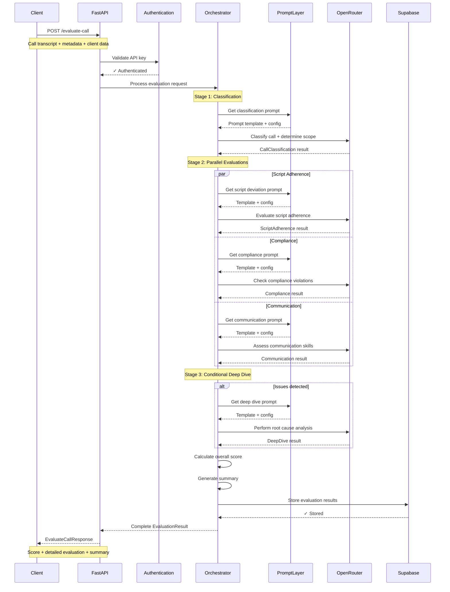

# Eavesly - Pennie Call QA System

An AI-enabled call quality assessment system built with FastAPI that provides comprehensive evaluation of customer service calls using advanced language models and structured evaluation frameworks.

## 🚀 Features

- **AI-Powered Analysis**: Uses OpenRouter for advanced LLM capabilities
- **Structured Evaluation**: Employs PromptLayer for consistent prompt management
- **Scalable Architecture**: Built on FastAPI with async support
- **Comprehensive Logging**: Structured logging with request tracing
- **Data Persistence**: Supabase integration for reliable data storage
- **Modern Tooling**: UV package management for fast, reliable dependency handling

## 🔄 API Flow

The Eavesly API processes call evaluations through a sophisticated multi-stage workflow:



### Key Evaluation Stages

1. **🎯 Classification** - Determines call outcome and evaluation scope
2. **⚡ Parallel Evaluations** - Concurrent analysis of:
   - Script adherence and deviations
   - Regulatory compliance (TCPA, CFPB, etc.)
   - Communication skills and professionalism
3. **🔍 Deep Dive** - Triggered when issues are detected for root cause analysis
4. **📊 Scoring & Summary** - Weighted scoring algorithm with actionable insights

### 📝 API Example

**Request** (`POST /evaluate-call`)
```json
{
  "call_id": "call_123456",
  "agent_id": "agent_789",
  "call_context": "First Call",
  "transcript": {
    "transcript": "Agent: Hello, this is Sarah from MigoLoans. May I speak with John? Customer: This is John. Agent: Great! I'm calling about your loan application...",
    "metadata": {
      "duration": 450,
      "timestamp": "2024-01-15T10:30:00Z",
      "disposition": "completed"
    }
  },
  "client_data": {
    "script_progress": {
      "sections_attempted": [1, 2, 3, 4, 5],
      "last_completed_section": 5,
      "termination_reason": "completed"
    },
    "financial_profile": {
      "annual_income": 75000,
      "dti_ratio": 0.35,
      "loan_approval_status": "approved"
    }
  },
  "ideal_script": "Section 1: Introduction and verification..."
}
```

**Response**
```json
{
  "call_id": "call_123456",
  "correlation_id": "eval_abc123def456",
  "timestamp": "2024-01-15T10:35:00Z",
  "processing_time_ms": 2847,
  "overall_score": 87,
  "summary": {
    "strengths": [
      "Excellent rapport building with client",
      "Clear explanation of loan terms"
    ],
    "areas_for_improvement": [
      "Could have addressed objections more thoroughly"
    ],
    "critical_issues": []
  },
  "evaluation": {
    "classification": {
      "call_outcome": "completed",
      "early_termination_justified": true,
      "requires_deep_dive": false
    },
    "script_deviation": {
      "overall_adherence": "high",
      "sections": {
        "introduction": {"adherence_level": "high", "critical_misses": []},
        "needs_assessment": {"adherence_level": "medium", "critical_misses": []}
      }
    },
    "compliance": {
      "summary": {
        "violations": [],
        "coaching_needed": ["Improve disclosure timing"]
      }
    },
    "communication": {
      "summary": {
        "exceeded": ["Professionalism", "Empathy"],
        "missed": ["Objection handling"]
      }
    }
  }
}
```

## 📋 Prerequisites

- **Python 3.9+**
- **UV Package Manager** - [Install UV](https://docs.astral.sh/uv/getting-started/installation/)
- **API Keys** for:
  - [OpenRouter](https://openrouter.ai/) - LLM access
  - [PromptLayer](https://promptlayer.com/) - Prompt management
  - [Supabase](https://supabase.com/) - Database and storage

## 🛠️ Quick Start

### 1. Clone and Setup
```bash
# Clone the repository
git clone https://github.com/pennie/eavesly.git
cd eavesly

# Install dependencies and create virtual environment
uv sync
```

### 2. Configure Environment
```bash
# Copy environment template
cp .env.example .env

# Edit .env with your API keys and configuration
# See Configuration section below for details
```

### 3. Run the Application
```bash
# Development server with auto-reload
uv run uvicorn app.main:app --reload --port 8000

# Or use the shortcut
uv run fastapi dev app.main:app
```

The API will be available at `http://localhost:8000` with interactive docs at `http://localhost:8000/docs`.

## 🔧 Development Setup

### Activate Virtual Environment
```bash
# Activate UV-managed virtual environment
source .venv/bin/activate
# Or use UV shell
uv shell
```

### Code Quality Tools
```bash
# Format code
uv run black .

# Lint code
uv run ruff check .
uv run ruff check . --fix  # Auto-fix issues

# Type checking
uv run mypy .

# Run tests
uv run pytest

# Run all quality checks
uv run black . && uv run ruff check . && uv run mypy . && uv run pytest
```

### Adding Dependencies
```bash
# Add runtime dependency
uv add package-name

# Add development dependency
uv add --dev package-name

# Sync dependencies after changes
uv sync
```

## 📚 API Documentation

Once running, access the interactive API documentation:

- **Swagger UI**: `http://localhost:8000/docs`
- **ReDoc**: `http://localhost:8000/redoc`
- **OpenAPI JSON**: `http://localhost:8000/openapi.json`

## ⚙️ Configuration

The application uses environment variables for configuration. Copy `.env.example` to `.env` and configure:

### Required API Keys
- `OPENROUTER_API_KEY`: Your OpenRouter API key for LLM access
- `PROMPTLAYER_API_KEY`: PromptLayer key for prompt management
- `INTERNAL_API_KEY`: Secure key for internal API endpoints

### Supabase Configuration
- `SUPABASE_URL`: Your Supabase project URL
- `SUPABASE_ANON_KEY`: Supabase anonymous key
- `SUPABASE_SERVICE_ROLE_KEY`: Supabase service role key (keep secret)

### Application Settings
- `ENVIRONMENT`: development, staging, or production
- `PORT`: Server port (default: 8000)
- `LOG_LEVEL`: Logging level (default: INFO)
- `DEBUG`: Enable debug mode (default: false in production)

See `.env.example` for complete configuration details.

## 📁 Project Structure

```
eavesly/
├── app/
│   ├── __init__.py
│   ├── main.py              # FastAPI application entry point
│   ├── config.py            # Application configuration
│   ├── api/                 # API route definitions
│   ├── models/              # Pydantic models and schemas
│   ├── services/            # Business logic and external integrations
│   └── utils/               # Utility functions and helpers
├── tests/                   # Test suite
├── pyproject.toml          # Project configuration and dependencies
├── uv.lock                 # UV lock file for reproducible builds
└── .env.example            # Environment configuration template
```

## 🧪 Testing

```bash
# Run all tests
uv run pytest

# Run tests with coverage
uv run pytest --cov=app

# Run specific test file
uv run pytest tests/test_specific.py

# Run tests with verbose output
uv run pytest -v
```

## 🤝 Contributing

1. **Fork the repository**
2. **Create a feature branch**: `git checkout -b feature/amazing-feature`
3. **Install dependencies**: `uv sync`
4. **Make your changes**
5. **Run quality checks**: `uv run black . && uv run ruff check . && uv run mypy .`
6. **Run tests**: `uv run pytest`
7. **Commit your changes**: `git commit -m 'Add amazing feature'`
8. **Push to branch**: `git push origin feature/amazing-feature`
9. **Open a Pull Request**

### Code Standards
- Follow PEP 8 style guidelines (enforced by Black and Ruff)
- Add type hints for all functions (checked by MyPy)
- Write tests for new functionality
- Update documentation as needed

## 📝 License

This project is licensed under the MIT License - see the [LICENSE](LICENSE) file for details.

## 🆘 Support

For support and questions:
- Create an [issue](https://github.com/pennie/eavesly/issues)
- Check the [documentation](https://github.com/pennie/eavesly/docs)
- Contact the Pennie Engineering team