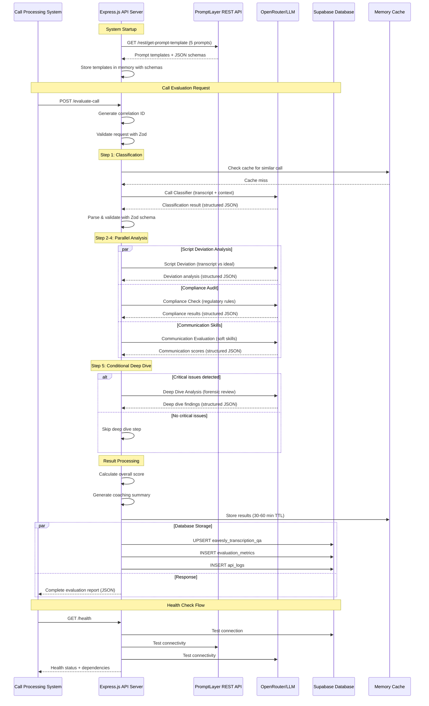

Product Requirements Document: AI-Enabled Call QA Workflow
Version: 1.2

Status: In Development

Last Updated: September 2, 2025

Author: Gemini

Stakeholders: Head of Sales, Compliance Officer, QA Manager, Engineering Lead

1. Introduction & Overview
This document outlines the requirements for the AI-Enabled Call QA Workflow, a system designed to automate the quality assurance process for Pennie's sales calls. The current manual review process is time-consuming, subjective, and provides limited coverage. This project will implement a robust, API-driven service that leverages Large Language Models (LLMs) to analyze 100% of call transcripts for compliance, script adherence, and communication skills, providing objective, structured, and actionable feedback.

2. Problem Statement
The manual review of sales calls is a significant operational bottleneck. The process is:

Slow & Inefficient: A QA manager can only review a small fraction of the total calls, spending 15-20 minutes per call. This leaves the majority of calls unaudited.

Inconsistent & Subjective: Human reviewers can interpret interactions differently, leading to inconsistent scoring and agent feedback.

High-Risk: With limited coverage, critical compliance violations can be missed, exposing Pennie to regulatory risk and damaging customer trust.

Delayed Feedback Loop: Agents often wait days or weeks to receive feedback, making it difficult to correct behaviors promptly.

This project aims to solve these problems by creating a system that is fast, objective, comprehensive, and provides near-instant feedback.

3. Goals & Objectives
The primary goals of this project are to:

Increase QA Coverage: Automatically analyze and score 100% of all sales call transcripts.

Improve Efficiency: Reduce the time required to score a call from >15 minutes to under 60 seconds.

Enhance Compliance: Instantly flag and escalate critical compliance violations for immediate review.

Standardize Feedback: Provide objective, consistent, and data-driven feedback on agent performance based on a standardized rubric.

Generate Actionable Insights: Enable sales leadership to identify performance trends and coaching opportunities across the entire sales team.

4. User Personas
QA Manager: Needs a reliable tool to monitor all agent interactions, quickly identify high-risk calls, and spend their time on deep-dive coaching rather than routine listening.

Sales Leader: Needs high-level assurance of team-wide compliance and performance metrics to guide strategy and training initiatives.

Sales Agent: Needs fast, fair, and consistent feedback on their calls to understand their strengths and areas for improvement.

5. Features & Scope
In Scope (MVP)
Automated Evaluation API:

A single, secure API endpoint (/evaluate-call) that accepts a call transcript, an ideal script, and call context.

The API will process the request and return a structured JSON FinalReport.

Multi-Layered Analysis Engine: The core of the service, which orchestrates five distinct LLM calls to evaluate different aspects of the conversation:

Call Classifier: Initial triage to determine call context, progress, and flag critical red flags.

Script Deviation Analysis: Measures how closely the agent's conversation followed a provided ideal script, fairly handling early terminations and follow-up calls.

Compliance Audit: A detailed check against a non-negotiable list of regulatory and company policy requirements.

Communication Skills Evaluation: Scores the agent's soft skills, such as tone, empathy, and active listening.

Conditional Deep Dive: A forensic analysis triggered only for calls with critical violations.

Structured JSON Output: The API will return a predictable, well-defined JSON object containing the results from all analysis layers, an overall score, and a coaching summary.

Prompt Management via PromptLayer with Structured Outputs: All prompts and their associated JSON schemas will be managed in the PromptLayer registry with built-in structured outputs support, ensuring guaranteed type-safe responses and allowing for updates without code deployment.

5.1. System Architecture & Workflow

The following sequence diagram illustrates how components interact during a call evaluation:



5.2. Key Design Choices

Context-Aware Evaluation for Call Scenarios: The system is designed to handle real-world call scenarios intelligently, ensuring agents are evaluated fairly. This is managed through a two-step process:

Contextual Classification: The initial Call Classifier prompt analyzes the call_context ("First Call" or "Follow-up Call") and the transcript to determine the call's intended scope. It identifies the logical startingSection and a list of expectedSections for the evaluation. This prevents the system from incorrectly assuming every call must start at Section 1.

Fair Deviation Analysis: The Script Deviation Analysis prompt receives this context. It only evaluates the agent against the expectedSections. If a call ends prematurely, any expected sections that were not covered are marked as 'Not Reached'. This status is neutral and does not negatively impact the agent's score, providing an accurate assessment of the portion of the call that actually occurred.

5.3. Context-Aware Evaluation with Script Progress

The system uses detailed script progress information provided in the API request to ensure fair and accurate evaluation of agent performance. This approach recognizes that calls naturally follow different paths based on customer responses and outcomes.

**Script Progress Intelligence**

The `scriptProgress` object in the request payload contains:
- `sectionsAttempted`: Array of script sections the agent covered [1,2,3,4,5,6,7,8,9]
- `lastCompletedSection`: Highest section number fully completed
- `terminationReason`: Why the call ended (loan_approved, loan_denied, not_interested, etc.)

**Evaluation Scope Determination**

Each evaluation prompt receives context about what sections should be assessed:
- **Classification**: Reviews entire transcript to understand call flow and outcomes
- **Script Deviation**: Only evaluates `sectionsAttempted`, ignoring unreached sections
- **Compliance**: Focuses on sections where compliance rules apply (typically sections 3-8)
- **Communication**: Assesses quality across all attempted interactions
- **Deep Dive**: Triggered by critical issues regardless of script progress

**Fair Assessment Logic**

```typescript
// Example: Script deviation evaluation scope
const evaluationScope = {
  sectionsToEvaluate: scriptProgress.sectionsAttempted,
  sectionsNotReached: allSections.filter(s => !sectionsAttempted.includes(s)),
  terminationContext: scriptProgress.terminationReason,
  expectedOutcome: deriveExpectedOutcome(terminationReason, financialProfile)
};

// Sections not reached are marked as 'Not Applicable' rather than 'Poor'
// Early termination due to loan denial is contextually appropriate
```

**Outcome-Specific Evaluation**

Different termination reasons trigger different evaluation criteria:
- **loan_approved**: Full script adherence expected through closing
- **loan_denied**: Professional handling of rejection, compliance with disclosure requirements
- **not_interested**: Respectful disengagement, attempt to understand objections
- **callback_scheduled**: Clear next steps, appropriate follow-up commitment

This context-aware approach ensures agents are evaluated fairly based on the actual call dynamics rather than rigid script expectations.

Out of Scope (Future Enhancements)
A user-facing dashboard for viewing reports. (This PRD covers the back-end API only).

Direct integration with the call recording/transcription service (transcripts will be pushed to the API).

Real-time, in-call analysis or agent assistance.

Automated delivery of feedback reports to agents.

6. Technical Requirements
Technology Stack:

Language: TypeScript

Framework: Node.js with Express.js

Schema Validation: Zod (with PromptLayer structured outputs integration)

Deployment: Docker

Required Dependencies:
- openai: OpenAI SDK with structured outputs support
- zod: Schema validation and TypeScript type inference
- p-limit: Concurrency control for parallel API calls

Optional Future Dependencies:
- @promptlayer/sdk: PromptLayer request logging (future enhancement)

Architecture:

The system will be a stateless, containerized microservice.

It will follow the multi-prompt orchestration pattern detailed in the project documentation.

API keys and other secrets will be managed via environment variables (.env file).

Prompt & LLM Management with Structured Outputs:

The application will fetch prompt templates with embedded JSON schemas directly from the PromptLayer REST API at startup using standard HTTP requests. The API returns templates in this structure:
- `prompt_template.messages[]` - Array of system/user prompts with nested `prompt.template` content
- `prompt_template.input_variables[]` - Required template variables
- `metadata.model` - Model configuration (name, parameters including temperature)
- JSON schemas are stored in `metadata.model.parameters.response_format`

All LLM calls will be routed through OpenRouter with structured output support. PromptLayer request logging is optional and can be added as a future enhancement.

JSON Schema Integration: Each prompt template in PromptLayer will include a JSON schema definition for structured outputs, eliminating parsing errors and ensuring type-safe responses.

Structured Outputs Benefits: 
- Zero JSON parsing errors with guaranteed schema compliance
- Type-safe responses validated against Zod schemas at runtime
- Simplified error handling without manual JSON parsing try/catch blocks
- Reduced code complexity (~40% less code than manual parsing approaches)
- Enhanced reliability through automatic retry logic for malformed responses

Performance:

The P95 latency for a response from the /evaluate-call endpoint should be under 60 seconds.

Performance Optimization Strategy:

Intelligent Caching: Schema-validated caching of evaluation results with 30-60 minute TTL

Parallel Processing: Concurrent evaluation of compliance, communication, and script adherence (3 parallel calls)

Request Batching: Rate-limited concurrent API calls with exponential backoff

Token Usage Optimization: Automatic token usage tracking and cost monitoring per prompt template

6.1. Data Storage & Persistence

Database:

Supabase PostgreSQL will serve as the primary data storage layer for audit trails, metrics, and evaluation history.

Evaluation results will be stored for trend analysis, compliance reporting, and system optimization.

Data retention policy: 90 days for detailed evaluation results, indefinite for aggregated metrics.

Core Tables:

call_evaluations: Complete evaluation results with correlation IDs for traceability.

evaluation_metrics: Performance metrics, latency data, and system health indicators.

api_logs: Request/response audit trail for debugging and compliance.

Data Consistency:

All database operations will use correlation IDs to track requests across the 5-step evaluation process.

Automatic timestamp recording for all table inserts.

Structured JSON storage for evaluation results to enable flexible querying.

6.2. Error Handling & Resilience

LLM API Resilience:

Exponential backoff retry strategy: 1s, 2s, 4s delays with jitter.

Maximum 3 retry attempts per LLM call before failure.

Circuit breaker pattern for OpenRouter/PromptLayer dependencies with 30-second reset timeout.

Timeout configuration: 45 seconds per individual LLM call, 180 seconds total request timeout.

Graceful Degradation:

Partial evaluation results: If non-critical prompts fail, return available analysis with clear status indicators.

Fallback responses: Standardized error responses with correlation IDs for tracking.

Fail-fast approach: Critical failures (authentication, prompt template retrieval) abort immediately.

Error Classification:

Transient errors (rate limits, network timeouts): Retry with backoff.

Permanent errors (invalid API keys, malformed requests): Fail immediately with detailed error codes.

Partial failures: Continue processing remaining prompts, flag incomplete sections.

Structured Output Fallback Strategy:

Primary: OpenRouter with PromptLayer structured outputs for guaranteed JSON compliance

Secondary: Direct OpenAI fallback when OpenRouter structured outputs are unsupported

Tertiary: Predefined fallback responses with manual review flags for critical failures

Fallback Response Examples: Safe default responses that trigger manual review workflows while maintaining system availability

6.3. Monitoring & Observability

Health Checks:

/health endpoint for Fly.io health monitoring and load balancer checks.

Deep health checks: PromptLayer connectivity, Supabase connection, prompt template availability.

Startup readiness checks: All dependencies initialized before accepting requests.

Structured Logging:

JSON-formatted logs with correlation IDs linking all operations for a single request using a lightweight custom logger built on Node.js console methods.

Log levels: ERROR (failures), WARN (retries/degraded performance), INFO (request lifecycle), DEBUG (detailed tracing).

Sensitive data filtering: No call transcripts or personal information in logs.

Custom Logger Implementation:
```typescript
const logger = {
  info: (message: string, meta?: any) => console.log(JSON.stringify({ 
    level: 'info', message, ...meta, timestamp: new Date().toISOString() 
  })),
  error: (message: string, meta?: any) => console.error(JSON.stringify({ 
    level: 'error', message, ...meta, timestamp: new Date().toISOString() 
  })),
  warn: (message: string, meta?: any) => console.warn(JSON.stringify({ 
    level: 'warn', message, ...meta, timestamp: new Date().toISOString() 
  }))
};
```

Metrics Collection:

Performance metrics: P50, P95, P99 latencies stored in Supabase for trend analysis.

Business metrics: Evaluation success rate, prompt-specific performance, compliance violation rates.

System metrics: LLM token usage, API call counts, error rates by category.

Real-time monitoring via Supabase dashboard queries for operational visibility.

6.4. Internal Security & Authentication

API Authentication:

API key-based authentication using X-API-Key header for internal service-to-service communication.

API keys managed via Fly.io secrets with rotation capability.

Rate limiting: 100 requests per 15-minute window per API key to prevent abuse.

Input Validation:

Zod schema validation for all incoming requests to prevent malformed data processing.

Sanitization of transcript data to remove potential injection attacks.

Request size limits: 10MB maximum request size to prevent resource exhaustion.

Secrets Management:

All sensitive configuration stored in Fly.io secrets, not environment variables.

Automatic secret rotation support for API keys.

No secrets logged or exposed in error messages.

Data Protection:

Call transcript data encrypted in transit and at rest via Supabase's built-in encryption.

Correlation IDs for audit trails without exposing sensitive customer data.

Automatic data retention policy enforcement.

7. Success Metrics
The success of this project will be measured by:

Business Impact Metrics:

QA Coverage: % of total calls automatically scored (Target: 100%).

Operational Efficiency: Average time to score a call (Target: < 60s).

Risk Reduction: Time to detect critical compliance violation (Target: < 5 minutes from transcript availability).

Consistency: Reduction in scoring variance between human and AI reviewers on a sample set of calls (Target: >90% agreement on critical violations).

System Reliability Metrics:

System Uptime: Service availability (Target: 99.9% uptime).

API Success Rate: Percentage of successful evaluation requests (Target: >95%).

Error Recovery Rate: Percentage of failed requests that succeed on retry (Target: >80%).

Performance Consistency: P95 latency within SLA (Target: <60s for 95% of requests).

Data Integrity: Percentage of evaluations successfully stored in Supabase (Target: 100%).

Structured Output Quality Metrics:

Schema Compliance Rate: Percentage of LLM responses that match defined schemas without parsing errors (Target: 100%)

Fallback Usage Rate: Percentage of requests requiring fallback mechanisms (Target: <5%)

Cache Hit Rate: Percentage of requests served from cache to optimize performance (Target: >30%)

Token Efficiency: Average tokens per evaluation compared to baseline manual parsing approach (Target: 15% reduction)

8. Roadmap
Phase 1 (MVP - Current Scope):

Develop and deploy the core Express.js service with all five evaluation prompts.

Set up Docker configuration for production deployment.

Configure PromptLayer prompt templates with embedded JSON schemas for all 5 evaluation prompts.

Run a pilot program with the QA team to validate accuracy and schema compliance.

Phase 2 (Integration):

Build the pipeline to automatically feed transcripts from the call system into the QA API.

Phase 3 (Dashboard & Feedback):

Develop a simple front-end application to view, search, and filter QA reports.

Design a workflow for delivering reports to agents and managers.

9. API Specification

The Call QA Service exposes a REST API for internal use by Pennie's call processing systems.

9.1. Authentication

All API requests require authentication via the X-API-Key header:

```
X-API-Key: <internal-api-key>
```

API keys are managed via Fly.io secrets and should be rotated regularly.

9.2. Endpoints

POST /evaluate-call

Primary endpoint for call evaluation requests.

Request Schema:
```json
{
  "callId": "string (required) - Unique identifier for the call",
  "agentId": "string (required) - Agent identifier for tracking", 
  "callContext": "string (required) - Either 'First Call' or 'Follow-up Call'",
  "transcript": {
    "transcript": "string (required) - Full call transcript text",
    "metadata": {
      "duration": "number (required) - Call duration in seconds",
      "timestamp": "string (required) - ISO 8601 timestamp",
      "talkTime": "number (optional) - Actual talk time in seconds",
      "disposition": "string (required) - Call disposition/outcome",
      "campaignName": "string (optional) - Campaign identifier"
    }
  },
  "idealScript": "string (required) - Expected script for comparison with section markers",
  "clientData": {
    "leadId": "string (optional) - CRM lead identifier",
    "campaignId": "number (optional) - Campaign identifier",
    "scriptProgress": {
      "sectionsAttempted": "array (required) - List of script sections attempted [1,2,3,4,5,6,7,8,9]",
      "lastCompletedSection": "number (required) - Highest section number fully completed",
      "terminationReason": "string (required) - Why call ended (loan_approved, loan_denied, not_interested, callback_scheduled, etc.)",
      "pitchOutcome": "string (optional) - Final disposition from agent"
    },
    "financialProfile": {
      "annualIncome": "number (optional) - Annual income for compliance context",
      "dtiRatio": "number (optional) - Debt-to-income ratio",
      "loanApprovalStatus": "string (optional) - approved, denied, pending",
      "hasExistingDebt": "boolean (optional) - Whether customer has existing debt"
    }
  }
}
```

Response Schema (Success - 200):
```json
{
  "callId": "string - Echo of request callId",
  "correlationId": "string - Unique ID for tracking this evaluation",
  "timestamp": "string - ISO 8601 evaluation timestamp",
  "processingTimeMs": "number - Total processing time",
  "evaluation": {
    "classification": { /* CallClassification schema */ },
    "scriptDeviation": { /* ScriptDeviation schema */ },
    "compliance": { /* Compliance schema */ },
    "communication": { /* Communication schema */ },
    "deepDive": { /* DeepDive schema - only if triggered */ }
  },
  "overallScore": "number - Composite score 1-100",
  "summary": {
    "strengths": ["array of strings"],
    "areasForImprovement": ["array of strings"],
    "criticalIssues": ["array of strings"]
  }
}
```

GET /health

Health check endpoint for monitoring and load balancing.

Response (200):
```json
{
  "status": "healthy",
  "timestamp": "string - ISO 8601 timestamp",
  "dependencies": {
    "supabase": "healthy|unhealthy",
    "promptLayer": "healthy|unhealthy",
    "openRouter": "healthy|unhealthy"
  },
  "uptime": "number - Uptime in seconds"
}
```

9.3. Error Responses

All error responses follow a consistent format:

```json
{
  "error": {
    "code": "string - Error code (e.g., INVALID_REQUEST, LLM_TIMEOUT)",
    "message": "string - Human-readable error description",
    "correlationId": "string - For tracking and debugging",
    "timestamp": "string - ISO 8601 error timestamp",
    "details": {} // Optional additional error context
  }
}
```

Common HTTP Status Codes:
- 200: Success
- 400: Invalid request (malformed JSON, missing required fields)
- 401: Unauthorized (invalid or missing API key)
- 429: Rate limit exceeded
- 500: Internal server error
- 503: Service unavailable (dependencies unhealthy)

9.4. Rate Limiting

Rate limits are applied per API key:
- 100 requests per 15-minute window
- Burst limit: 10 requests per minute

Rate limit headers are included in all responses:
```
X-RateLimit-Limit: 100
X-RateLimit-Remaining: 95
X-RateLimit-Reset: 1699123456
```

10. Database Schema

### 10.1 Integration with Existing Tables

The Call QA service integrates with existing Pennie database infrastructure, extending current tables while adding operational support tables. This approach preserves existing data and maintains backward compatibility.

#### Extended Table: eavesly_transcription_qa

The existing `eavesly_transcription_qa` table will be enhanced to support API-driven evaluations while maintaining all current functionality:

```sql
-- Migration: Add API evaluation fields to existing table
ALTER TABLE eavesly_transcription_qa 
ADD COLUMN correlation_id TEXT UNIQUE,
ADD COLUMN processing_time_ms INTEGER,
ADD COLUMN classification_result JSONB,
ADD COLUMN script_deviation_result JSONB,
ADD COLUMN compliance_result JSONB,
ADD COLUMN communication_result JSONB,
ADD COLUMN deep_dive_result JSONB,
ADD COLUMN api_overall_score INTEGER CHECK (api_overall_score >= 1 AND api_overall_score <= 100),
ADD COLUMN api_strengths JSONB, -- Array of strings
ADD COLUMN api_areas_for_improvement JSONB, -- Array of strings  
ADD COLUMN api_critical_issues JSONB, -- Array of strings
ADD COLUMN evaluation_version TEXT DEFAULT 'v1',
ADD COLUMN api_evaluation_timestamp TIMESTAMP WITH TIME ZONE;

-- Add indexes for API queries
CREATE INDEX idx_qa_correlation_id ON eavesly_transcription_qa(correlation_id);
CREATE INDEX idx_qa_api_overall_score ON eavesly_transcription_qa(api_overall_score);
CREATE INDEX idx_qa_evaluation_version ON eavesly_transcription_qa(evaluation_version);
CREATE INDEX idx_qa_api_evaluation_timestamp ON eavesly_transcription_qa(api_evaluation_timestamp);
```

#### Data Integration Strategy

The system uses existing call data for context without duplication:
- **Call metadata** comes from `eavesly_calls` table via `call_id` JOIN
- **Transcript data** is already stored in `eavesly_transcription_qa`  
- **Evaluation results** are stored in new columns alongside existing QA data

### 10.2 New Supporting Tables

```sql
-- Performance and system metrics
CREATE TABLE evaluation_metrics (
    id UUID PRIMARY KEY DEFAULT gen_random_uuid(),
    correlation_id TEXT, -- References eavesly_transcription_qa.correlation_id
    
    -- Metric identification
    metric_name TEXT NOT NULL,
    metric_value NUMERIC NOT NULL,
    metric_unit TEXT, -- 'ms', 'count', 'percentage', etc.
    
    -- Categorization
    metric_category TEXT NOT NULL, -- 'performance', 'business', 'system'
    tags JSONB, -- Additional metadata as key-value pairs
    
    -- Timestamps
    recorded_at TIMESTAMP WITH TIME ZONE DEFAULT NOW(),
    
    -- Indexes
    INDEX idx_evaluation_metrics_name (metric_name),
    INDEX idx_evaluation_metrics_category (metric_category),
    INDEX idx_evaluation_metrics_recorded_at (recorded_at),
    INDEX idx_evaluation_metrics_correlation_id (correlation_id)
);

-- API request/response audit trail
CREATE TABLE api_logs (
    id UUID PRIMARY KEY DEFAULT gen_random_uuid(),
    correlation_id TEXT NOT NULL,
    
    -- Request details
    api_key_hash TEXT NOT NULL, -- Hashed API key for security
    endpoint TEXT NOT NULL,
    http_method TEXT NOT NULL,
    request_size_bytes INTEGER,
    
    -- Response details  
    http_status_code INTEGER NOT NULL,
    response_size_bytes INTEGER,
    processing_time_ms INTEGER NOT NULL,
    
    -- Error tracking
    error_code TEXT,
    error_message TEXT,
    
    -- Timestamps
    request_timestamp TIMESTAMP WITH TIME ZONE DEFAULT NOW(),
    
    -- Indexes
    INDEX idx_api_logs_correlation_id (correlation_id),
    INDEX idx_api_logs_api_key_hash (api_key_hash),
    INDEX idx_api_logs_endpoint (endpoint),
    INDEX idx_api_logs_status_code (http_status_code),
    INDEX idx_api_logs_request_timestamp (request_timestamp)
);
```

### 10.3 Data Relationships

- **Primary evaluation storage**: `eavesly_transcription_qa` (extended with API columns)
- **Metrics tracking**: `evaluation_metrics` links via `correlation_id`
- **Audit trail**: `api_logs` tracks all API requests via `correlation_id`
- **Call context**: Retrieved from `eavesly_calls` via `call_id` JOIN when needed

### 10.4 Data Retention Policy

```sql
-- Implement via pg_cron or application logic
-- Delete detailed evaluation data older than 90 days  
-- Keep aggregated metrics indefinitely
```

### 10.5 Row Level Security (RLS) Policies

```sql
-- Enable RLS on new tables (existing table already has RLS enabled)
ALTER TABLE evaluation_metrics ENABLE ROW LEVEL SECURITY;
ALTER TABLE api_logs ENABLE ROW LEVEL SECURITY;

-- Service account has full access (configured via Supabase service role)
-- eavesly_transcription_qa already has appropriate RLS policies
-- Additional policies can be added for read-only dashboard access
```

11. Deployment Configuration

Deployment configuration for Fly.io with single US region setup:

11.1. Fly.io Configuration (fly.toml)

```toml
app = "pennie-call-qa"
primary_region = "iad" # US East Coast for optimal latency

[build]
  dockerfile = "Dockerfile"

[env]
  NODE_ENV = "production"
  PORT = "3000"

[http_service]
  internal_port = 3000
  force_https = true
  auto_stop_machines = false
  auto_start_machines = true
  min_machines_running = 1
  processes = ["app"]

  [[http_service.checks]]
    grace_period = "10s"
    interval = "30s"
    method = "GET"
    path = "/health"
    timeout = "5s"

[http_service.concurrency]
  type = "requests"
  hard_limit = 50
  soft_limit = 25

[[http_service.machines]]
  memory = "1gb"
  cpu_kind = "shared"
  cpus = 1

[metrics]
  port = 9091
  path = "/metrics"
```

11.2. Docker Configuration

```dockerfile
FROM node:18-alpine

WORKDIR /app

# Install dependencies first for better caching
COPY package*.json ./
RUN npm ci --only=production

# Copy application code
COPY . .

# Build TypeScript
RUN npm run build

# Health check for Docker
HEALTHCHECK --interval=30s --timeout=10s --retries=3 \
  CMD curl -f http://localhost:3000/health || exit 1

# Run as non-root user
USER node

EXPOSE 3000

CMD ["npm", "start"]
```

11.3. Environment Variables (Fly.io Secrets)

Required secrets to be set via `flyctl secrets set`:

```bash
flyctl secrets set SUPABASE_URL="https://your-project.supabase.co"
flyctl secrets set SUPABASE_ANON_KEY="your-anon-key"
flyctl secrets set SUPABASE_SERVICE_ROLE_KEY="your-service-role-key"
flyctl secrets set OPENROUTER_API_KEY="your-openrouter-key"
flyctl secrets set PROMPTLAYER_API_KEY="your-promptlayer-key"
flyctl secrets set INTERNAL_API_KEY="your-secure-internal-api-key"
```

11.4. Auto-scaling Configuration

```toml
[http_service.auto_scaling]
  min_machines = 1
  max_machines = 5
  
  # Scale up when CPU > 70% for 2 minutes
  [[http_service.auto_scaling.rules]]
    metric = "cpu"
    threshold = 70
    comparison = ">"
    duration = "2m"
    action = "scale_up"
  
  # Scale down when CPU < 30% for 5 minutes  
  [[http_service.auto_scaling.rules]]
    metric = "cpu"
    threshold = 30
    comparison = "<"
    duration = "5m"
    action = "scale_down"
```

11.5. Monitoring Integration

Fly.io provides built-in metrics. Additional monitoring can be configured via:

- Grafana dashboard for Fly.io metrics
- Custom metrics endpoint at `/metrics` for Prometheus scraping
- Supabase dashboard for database monitoring
- PromptLayer dashboard for LLM call analytics


12. Appendices

12.1. Example Orchestrator Implementation with Structured Outputs
import OpenAI from "openai";
import { z } from "zod";

// Schemas for structured output validation
import {
  CallClassificationSchema,
  ScriptDeviationSchema,
  ComplianceSchema,
  CommunicationSchema,
  DeepDiveSchema,
} from "./schemas";

export class CallQAOrchestrator {
  private openai: OpenAI;
  // Store for the fetched prompt templates with embedded JSON schemas
  private promptTemplates: Record<string, {
    systemPrompt: string;
    userPrompt: string;
    inputVariables: string[];
    schema: z.ZodSchema<any>;
    responseFormat: any;
    model: string;
    temperature: number;
  }> = {};

  constructor() {
    // Use standard OpenAI client configured for OpenRouter
    this.openai = new OpenAI({
      baseURL: "https://openrouter.ai/api/v1",
      apiKey: process.env.OPENROUTER_API_KEY,
      defaultHeaders: {
        "HTTP-Referer": process.env.YOUR_SITE_URL,
        "X-Title": process.env.YOUR_APP_NAME,
      },
    });
  }

  /**
   * Initializes the orchestrator by fetching all required prompt templates
   * with embedded JSON schemas from the PromptLayer REST API. This should be called once at startup.
   */
  public async initialize() {
    console.log("Initializing orchestrator by fetching prompts from PromptLayer REST API...");

    const promptConfigs = [
      { name: "call_qa_router_classifier", schema: CallClassificationSchema },
      { name: "call_qa_script_deviation", schema: ScriptDeviationSchema },
      { name: "call_qa_compliance", schema: ComplianceSchema },
      { name: "call_qa_communication", schema: CommunicationSchema },
      { name: "call_qa_deep_dive", schema: DeepDiveSchema },
    ];

    for (const config of promptConfigs) {
      try {
        // Fetch prompt template via REST API
        const response = await fetch(`https://api.promptlayer.com/rest/get-prompt-template?prompt_name=${config.name}`, {
          method: 'GET',
          headers: {
            'X-API-KEY': process.env.PROMPTLAYER_API_KEY!
          }
        });

        if (!response.ok) {
          throw new Error(`HTTP ${response.status}: ${await response.text()}`);
        }

        const promptData = await response.json();
        
        // Extract prompts from PromptLayer response structure
        const systemMessage = promptData.prompt_template.messages.find((m: any) => m.role === 'system');
        const userMessage = promptData.prompt_template.messages.find((m: any) => m.role === 'user');
        
        // Store the processed prompt template
        this.promptTemplates[config.name] = {
          systemPrompt: systemMessage?.prompt?.template || "",
          userPrompt: userMessage?.prompt?.template || "",
          inputVariables: promptData.prompt_template.input_variables || [],
          schema: config.schema,
          responseFormat: {
            type: "json_schema",
            json_schema: {
              name: config.name,
              schema: this.zodToJsonSchema(config.schema)
            }
          },
          model: promptData.metadata?.model?.name || "gpt-4o",
          temperature: promptData.metadata?.model?.parameters?.temperature || 1.0
        };
        
        console.log(`Successfully fetched prompt: ${config.name}`);
      } catch (error) {
        console.error(`Failed to fetch prompt: ${config.name}`, error);
        throw new Error(`Initialization failed: Could not fetch prompt ${config.name}.`);
      }
    }
    console.log("Orchestrator initialized successfully with REST API.");
  }

  // ... other methods like generateReport ...

  /**
   * Helper method to convert Zod schema to JSON schema format
   */
  private zodToJsonSchema(zodSchema: z.ZodSchema<any>): any {
    // This would need a proper implementation or library like zod-to-json-schema
    // For now, returning a placeholder that represents the conversion
    return {
      type: "object",
      properties: {},
      required: []
    };
  }

  private async getStructuredResponse<T>(
    promptTemplateName: string,
    input_variables: Record<string, any>,
    schema: z.ZodSchema<T>
  ): Promise<T> {
    const promptConfig = this.promptTemplates[promptTemplateName];
    if (!promptConfig) {
      throw new Error(`Prompt template ${promptTemplateName} not found.`);
    }

    // Simple template rendering - replace variables in format {{variable}}
    let systemPrompt = promptConfig.systemPrompt;
    let userPrompt = promptConfig.userPrompt;
    
    for (const [key, value] of Object.entries(input_variables)) {
      const placeholder = `{{${key}}}`;
      systemPrompt = systemPrompt.replace(new RegExp(placeholder, 'g'), String(value));
      userPrompt = userPrompt.replace(new RegExp(placeholder, 'g'), String(value));
    }

    try {
      const response = await this.openai.chat.completions.create({
        model: promptConfig.model,
        temperature: promptConfig.temperature,
        messages: [
          { role: "system", content: systemPrompt },
          { role: "user", content: userPrompt }
        ],
        response_format: promptConfig.responseFormat,
      });

      // Parse and validate the structured response
      const parsedContent = JSON.parse(response.choices[0].message.content!);
      return schema.parse(parsedContent); // Validate against Zod schema for type safety
    } catch (error) {
      console.error(
        `Error getting structured response for prompt: ${promptTemplateName}`,
        error
      );
      throw error;
    }
  }

  public async classifyCall(
    transcript: any,
    call_context: string,
    clientData: any,
    migo_call_script: string
  ): Promise<Classification> {
    // Uses PromptLayer template with structured output schema
    return this.getStructuredResponse("call_qa_router_classifier", {
        transcript: transcript.transcript,
        call_context: call_context,
        clientData: JSON.stringify(clientData),
        migo_call_script: migo_call_script,
        script_progress: JSON.stringify(clientData.scriptProgress),
        financial_profile: JSON.stringify(clientData.financialProfile),
      }, CallClassificationSchema);
  }

  public async analyzeScriptDeviation(
    actual_transcript: string,
    ideal_transcript: string,
    scriptProgress: any,
    terminationReason: string
  ): Promise<ScriptDeviation> {
    // Uses PromptLayer template with structured output schema  
    return this.getStructuredResponse("call_qa_script_deviation", {
        actual_transcript,
        ideal_transcript,
        sections_attempted: JSON.stringify(scriptProgress.sectionsAttempted),
        last_completed_section: scriptProgress.lastCompletedSection.toString(),
        termination_reason: terminationReason,
        evaluation_scope: JSON.stringify({
          sectionsToEvaluate: scriptProgress.sectionsAttempted,
          contextualTermination: terminationReason !== 'agent_error'
        })
      }, ScriptDeviationSchema);
  }

  public async analyzeCompliance(
    transcript: string,
    sectionsAttempted: number[],
    financialProfile: any
  ): Promise<Compliance> {
    // Only evaluate compliance for sections where rules apply
    const complianceSections = sectionsAttempted.filter(section => section >= 3 && section <= 8);
    
    return this.getStructuredResponse("call_qa_compliance", {
        transcript,
        sections_to_evaluate: JSON.stringify(complianceSections),
        financial_context: JSON.stringify(financialProfile),
        compliance_scope: JSON.stringify({
          creditDisclosureRequired: complianceSections.includes(4),
          loanTermsDisclosureRequired: complianceSections.includes(8),
          dtiDiscussionRequired: complianceSections.includes(7)
        })
      }, ComplianceSchema);
  }

  // ... other evaluation methods (analyzeCompliance, etc.) would follow the same pattern
  // Each method leverages structured output capabilities for guaranteed type-safe responses
}

12.2. Supabase Integration Examples

```typescript
import { createClient } from '@supabase/supabase-js';

export class DatabaseService {
  private supabase = createClient(
    process.env.SUPABASE_URL!,
    process.env.SUPABASE_SERVICE_ROLE_KEY!
  );

  async storeEvaluationResult(
    correlationId: string,
    callId: string,
    agentId: string | null,
    evaluationResults: any,
    processingTimeMs: number
  ) {
    // Upsert to existing eavesly_transcription_qa table
    const { data, error } = await this.supabase
      .from('eavesly_transcription_qa')
      .upsert({
        call_id: callId,
        correlation_id: correlationId,
        processing_time_ms: processingTimeMs,
        classification_result: evaluationResults.classification,
        script_deviation_result: evaluationResults.scriptDeviation,
        compliance_result: evaluationResults.compliance,
        communication_result: evaluationResults.communication,
        deep_dive_result: evaluationResults.deepDive,
        api_overall_score: evaluationResults.overallScore,
        api_strengths: evaluationResults.summary.strengths,
        api_areas_for_improvement: evaluationResults.summary.areasForImprovement,
        api_critical_issues: evaluationResults.summary.criticalIssues,
        evaluation_version: 'v1',
        api_evaluation_timestamp: new Date().toISOString(),
      }, {
        onConflict: 'call_id' // Update if transcript already exists
      });

    if (error) {
      throw new Error(`Database upsert failed: ${error.message}`);
    }

    return data;
  }

  async getCallContext(callId: string) {
    // Get call context from eavesly_calls table
    const { data, error } = await this.supabase
      .from('eavesly_calls')
      .select('type, disposition, campaign_name, agent_email, talk_time, started_at')
      .eq('call_id', callId)
      .single();

    if (error) {
      throw new Error(`Failed to fetch call context: ${error.message}`);
    }

    // Derive call context based on disposition and type
    const callContext = this.determineCallContext(data);
    
    return { ...data, derived_call_context: callContext };
  }

  private determineCallContext(callData: any): string {
    if (callData.disposition?.includes('callback') || 
        callData.disposition?.includes('follow-up') ||
        callData.type === 'inbound' && callData.campaign_name?.includes('callback')) {
      return 'Follow-up Call';
    }
    return 'First Call';
  }

  async recordMetric(
    correlationId: string,
    metricName: string,
    metricValue: number,
    metricCategory: string,
    metricUnit?: string,
    tags?: Record<string, any>
  ) {
    await this.supabase
      .from('evaluation_metrics')
      .insert({
        correlation_id: correlationId,
        metric_name: metricName,
        metric_value: metricValue,
        metric_category: metricCategory,
        metric_unit: metricUnit,
        tags,
      });
  }
}
```

12.3. Error Handling Examples

```typescript
import { z } from 'zod';

export class ErrorHandler {
  static handleLLMError(error: any, correlationId: string, promptName: string) {
    // Classify error type
    if (error.code === 'ETIMEDOUT' || error.message.includes('timeout')) {
      return {
        code: 'LLM_TIMEOUT',
        message: `LLM request timed out for prompt: ${promptName}`,
        correlationId,
        retryable: true,
      };
    }

    if (error.status === 429) {
      return {
        code: 'RATE_LIMIT_EXCEEDED',
        message: 'Rate limit exceeded for LLM provider',
        correlationId,
        retryable: true,
        retryAfterMs: 60000, // 1 minute
      };
    }

    if (error.status === 401 || error.status === 403) {
      return {
        code: 'LLM_AUTH_ERROR',
        message: 'Authentication failed with LLM provider',
        correlationId,
        retryable: false,
      };
    }

    // Default to internal error
    return {
      code: 'LLM_INTERNAL_ERROR',
      message: `Unexpected LLM error: ${error.message}`,
      correlationId,
      retryable: false,
    };
  }

  static async withRetry<T>(
    operation: () => Promise<T>,
    maxRetries: number = 3,
    baseDelay: number = 1000
  ): Promise<T> {
    let lastError: any;

    for (let attempt = 0; attempt <= maxRetries; attempt++) {
      try {
        return await operation();
      } catch (error) {
        lastError = error;

        if (attempt === maxRetries) {
          break; // No more retries
        }

        // Check if error is retryable
        const errorInfo = this.handleLLMError(error, 'unknown', 'unknown');
        if (!errorInfo.retryable) {
          throw error; // Don't retry non-retryable errors
        }

        // Exponential backoff with jitter
        const delay = baseDelay * Math.pow(2, attempt) + Math.random() * 1000;
        await new Promise(resolve => setTimeout(resolve, delay));
      }
    }

    throw lastError;
  }
}

// Circuit breaker implementation
export class CircuitBreaker {
  private failureCount = 0;
  private lastFailureTime = 0;
  private state: 'CLOSED' | 'OPEN' | 'HALF_OPEN' = 'CLOSED';

  constructor(
    private failureThreshold = 5,
    private resetTimeout = 30000 // 30 seconds
  ) {}

  async execute<T>(operation: () => Promise<T>): Promise<T> {
    if (this.state === 'OPEN') {
      if (Date.now() - this.lastFailureTime > this.resetTimeout) {
        this.state = 'HALF_OPEN';
      } else {
        throw new Error('Circuit breaker is OPEN');
      }
    }

    try {
      const result = await operation();
      this.onSuccess();
      return result;
    } catch (error) {
      this.onFailure();
      throw error;
    }
  }

  private onSuccess() {
    this.failureCount = 0;
    this.state = 'CLOSED';
  }

  private onFailure() {
    this.failureCount++;
    this.lastFailureTime = Date.now();

    if (this.failureCount >= this.failureThreshold) {
      this.state = 'OPEN';
    }
  }
}
